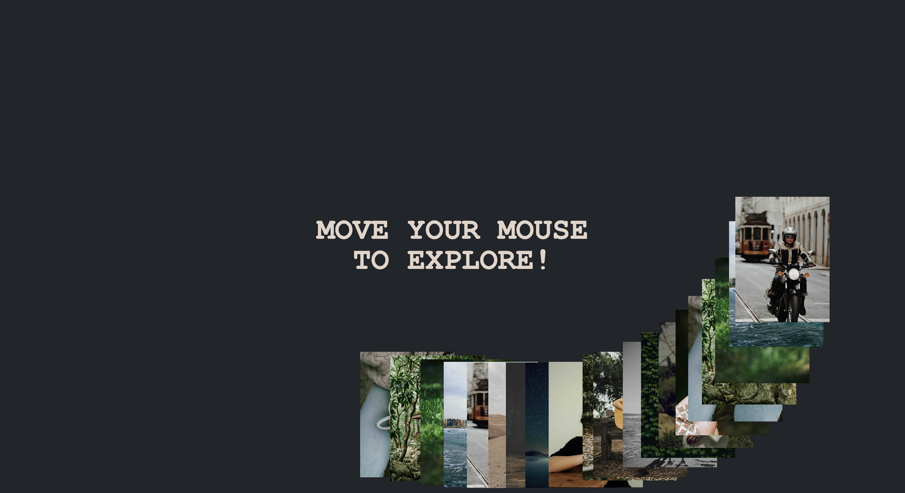

# Image Trail Animation

 

The Image trail animation is a simple project that uses HTML, CSS, and JavaScript to create an image trail effect. When the user moves the mouse, the images follow the cursor with a delay, creating a trail effect. This project is useful for creating interactive and engaging web pages.

## Getting Started

To use this project in your own work, follow these steps:

1. Clone the repository to your local machine.
2. Open `index.html` in your browser to view the project.
3. Customize the HTML, CSS, and JavaScript files as needed.

## Author

- [Farid Vatani - Software Engineer](https://github.com/faridvatani)

## Contributing

Contributions are welcome. Please feel free to fork this repository and open a pull request to add more features, fix bugs, improve documentation etc.

## Acknowledgements

This project was inspired by the "Awwwards Element" from [Rebellion](https://rblln.fr/en/agence).

## License

This project is licensed under the MIT License - see the [LICENSE](LICENSE) file for details.
